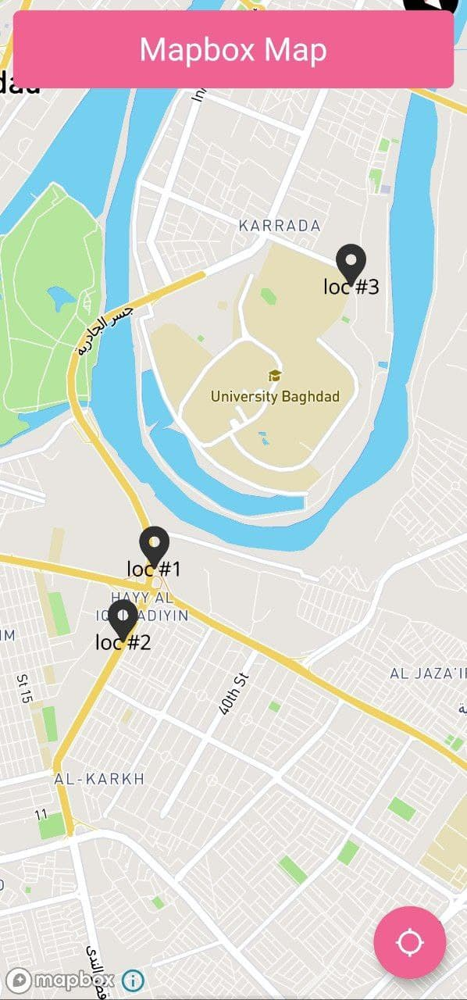
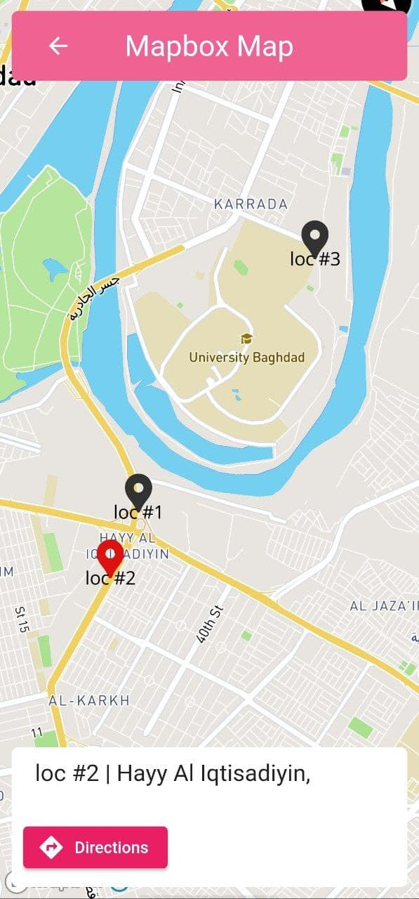
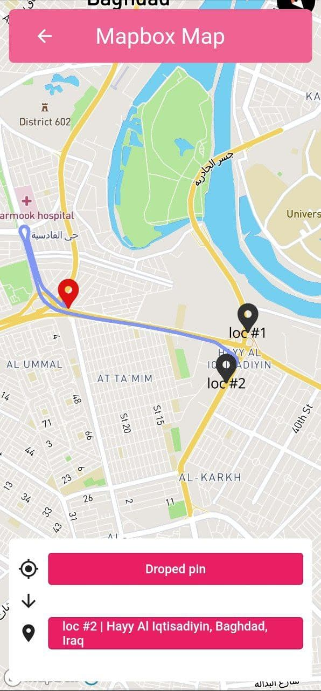
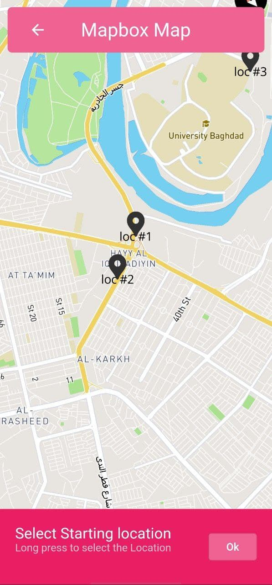

# Mapbox with navigation

The purpose of this project was to test the [mapbox_gl](https://pub.dev/packages/mapbox_gl) and [mapbox_api](https://pub.dev/packages/mapbox_api) packages to see if they were ready for real-world use and also because it was free.

P.S: Mapbox will give you a 25,000 free monthly active users and only 100,000 free requests for Directions API and same amount for Temporary Geocoding API (A search query).

### And my conclusion was:

1. Both packages hold a lot of potential if the developers behind it keep supporting it.

2. Definitely not ready for production. I had plenty of issues especially with the map controller and the documentations aren't very clear.

3. You need both packages to get basic map functionality, such as routing, forward geocoding, directions, etc.

4. They implement the same concepts as _Google Maps_ and can be used for learning and maybe doing some cool map-related stuff for free.

### What I used/implemented in this project:

1. Reverse geocoding api from mapbox_api package (To get location's name).
2. Directions api from mapbox_api package.
3. Device location & Location tracking from Location package.
4. Polyline package to decode the coordinates coming from Directions api.
5. MapboxMapController from mapbox_gl package to create/update symbols (Markers) on the map and to get coordinates.

## Screenshots






## Getting Started

First you have to creat mapbox account [here](https://account.mapbox.com/auth/signup/). Then obtain a free access token on your [Mapbox account page](https://account.mapbox.com/access-tokens/).

In the main directory, create an `.env` file and replace YOUR_ACCESS_TOKEN with the token you have gotten:

```
MAPBOX_ACCESS_TOKEN = "YOUR_ACCESS_TOKEN"
```

After that add a line like this to your package's `pubspec.yaml` file:

```
assets:
    - .env
```

And that's it, you can run the app now and play with it.
